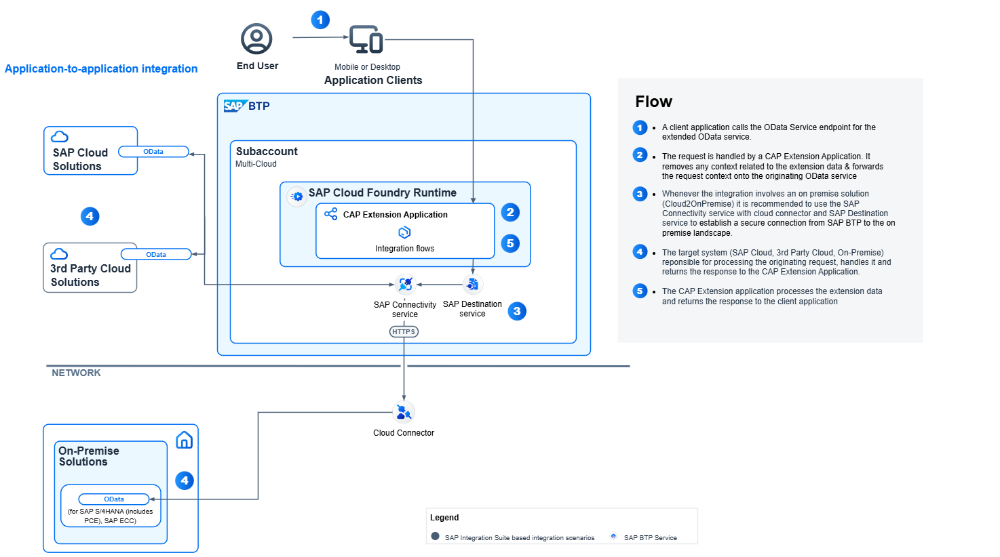
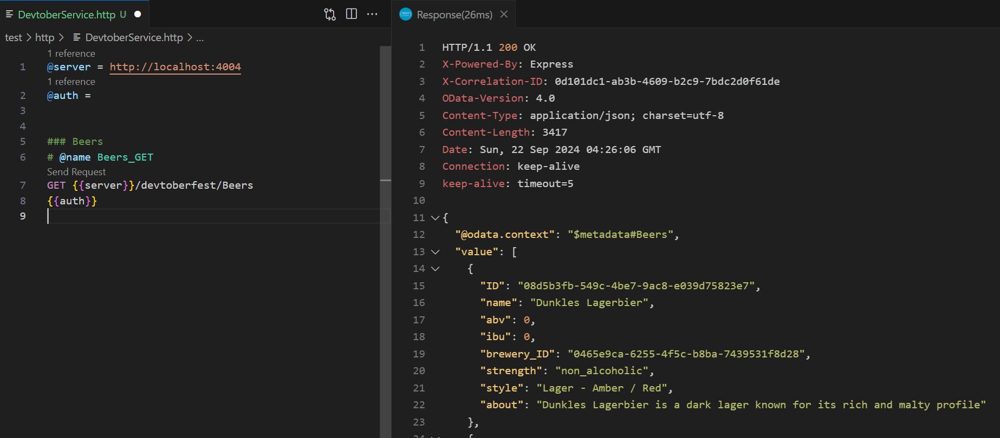

# Devtoberfest 2024 🍺- Extending your On-Premise OData Entities in CAP
Your organisation has an existing OData service(s) that provide functionality that you require to extend with your own customer specific properties/entities. This session explores an approach to how we could achieve this using SAP BTP and CAP (Node.js).


## Scenario
At Shebang we love beer & in homage to our predecessors (Shoutout to [Gregor Wolf](https://github.com/gregorwolf)) who gave us the [Postgres Beershop](https://github.com/gregorwolf/pg-beershop) 🍺, we wanted to build a new app to help customers review their beers from the beershop. 

To support building out our new features for beershop reviews, we need to add the following additional details to the ``Beers`` entity of the service ``beershop-admin``
- a new property for "style" 
- a new property for a short description "about"  
- a new property for a "strength" rating (i.e. low, mid, full, etc.) that is calculated based on the "ABV" of the beer   

## Solution
As part of the clean core concept, we can deliver these enhancements in our own customer environment on SAP BTP using the SAP Cloud Application Programming (CAP) for Node.js.  

We'll take the definition of the existing OData service and extend it to add our own custom fields to the existing OData entities, whilst ensuring that these fields are persisted in a separate, dedicated storage layer.

Now we will have a new service called ``devtoberfest`` with an entity `Beers`.  All requests to this service to read beers, first call the ``beershop-admin`` service to read the beers data and then a custom handler runs and amalgamates the data for custom data, before serving the response back to the client.   



## Getting started 
To setup & run this example locally, please follow the steps outlined in this section.

### Prerequisites
To run this demo you need to ensure you have installed the CAP development tools & VS Code locally or you are running this in the SAP Business Application Studio (BAS).  

If ths is your first time running a CAP application, we recommend you [register for the BTP Trial](https://developers.sap.com/tutorials/hcp-create-trial-account.html) for free and [setup BAS for development](https://developers.sap.com/tutorials/appstudio-onboarding.html) in BTP.    

### Download and Run Beershop App
Open a **new** terminal and run the following commands (one at a time)
```sh
# Download the Beershop repo and start running it on port 4005
git clone https://github.com/gregorwolf/pg-beershop.git 
cd pg-beershop 
npm install
cds watch --port 4005
```

Once running the beershop app will be running on [http://localhost:4005](http://localhost:4005) & you should similar output to below in the terminal
```sh
[cds] - server listening on { url: 'http://localhost:4005' }
[cds] - launched at 9/22/2024, 1:53:01 PM, version: 7.9.4, in: 1.954s
[cds] - [ terminate with ^C ]
```


### Download and Run Beershop Extension App
Open a second **new** terminal and run the following commands (one at a time)
```sh
# Download our repo and start running it on port 4004
git clone https://github.com/shebang-software/devtoberfest-2024.git
cd devtoberfest-2024
npm install
cds watch --port 4004
```

Once running the devtoberfest app will run on [http://localhost:4004](http://localhost:4004) & you should similar output to below in the terminal
```sh
[cds] - server listening on { url: 'http://localhost:4004' }
[cds] - launched at 9/22/2024, 2:00:17 PM, version: 8.2.2, in: 1.150s
[cds] - [ terminate with ^C ]
```

## Testing the service
Now the apps are both running you can test the services.  

In both the Postgres Beershop repository and this repository are ``.http`` test files which contain tests you can use to run the service in VS Code/BAS. These can be found in the [test](./test/http/) directories.  To use the requests in this file, you should ideally install the "REST Client for Visual Studio Code" plugin.  

To run a specific test, just press ``Send Request`` that you can see above each request.  



Alternatively copy the request and use your favourite REST Client (like or Postman or Curl) or a browser is totally sufficient for **GET** requests too.  

**Note when testing the PG Beershop app requests locally, you will need to enter user "alice" with no password to authenticate**

## Legal Disclaimers 
- This repository is for demo purposes only & is currently only configured to be used for local development. It cannot be deployed to SAP BTP without additional modifications
- The definition of the destination in the package.json is not recommended for productive use. You should use a destination in BTP for this 
- Please ensure you check the terms in our [license](./LICENSE) for all other details 
